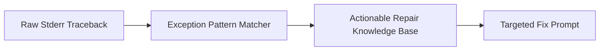

# genpark-critic-code-lint-test-feedback-synthesizer-skill

Diagnostic synthesizer translating raw tracebacks and compiler error codes into prioritized repair instructions for autonomous coding agents.

## Architecture

## Features
- **Targeted Heuristics**: Direct mapping from common runtime exceptions to structural repair actions.
- **Zero Dependencies**: 100% Python standard library.
